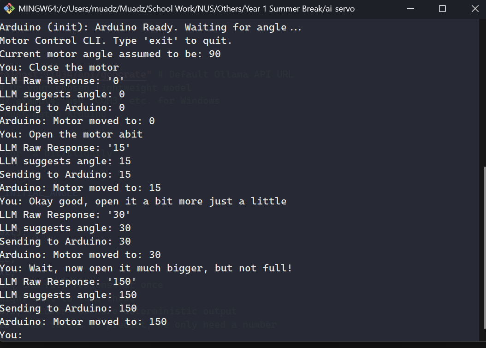
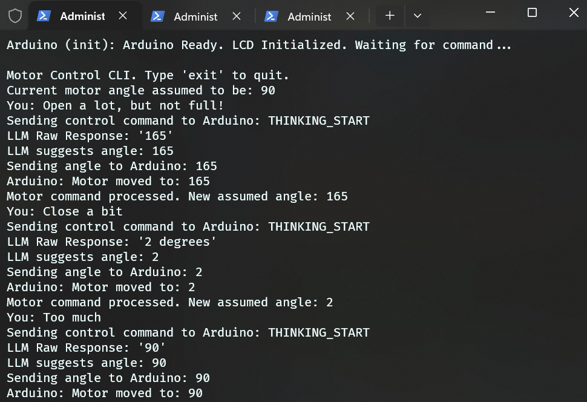
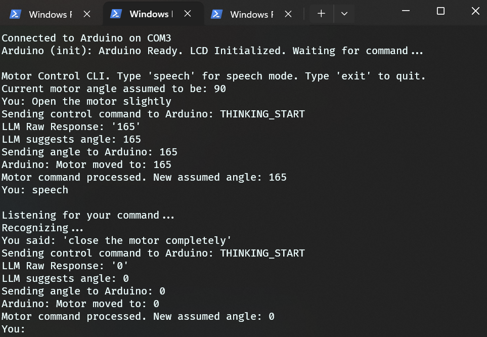
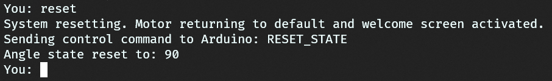

# Idea

I'm thinking of using an Arduino UNO hooked up to a servo motor and LCD display.
I want to incorporate a light weight AI model in this project.
Basically, I type in the CLI Terminal sentences like "Close the motor" or "Open the motor" and the motor will move accordingly. Also, terms like "Close the motor a bit/slightly" and "Open the motor a bit/slightly" will cause the motor to turn less. I will change the words if I want it to turn more, vice versa.

I can use Ollama phi3:mini model or other more light weight models as running service. Have it decide the final integer value needed to be sent to the arduino.

I'm using a Windows machine.

# Considerations & Improvements:

**Model Choice**: Llama 3 is powerful but might be overkill and slower. For faster responses and lower resource use, consider:

- mistral (7B)
- phi3 (even smaller, good for its size)
- gemma:2b

**Robustness of LLM Output**: LLMs can be verbose. You'll need good parsing logic in Python to extract the number. The "Respond ONLY with the integer" instruction helps, but isn't always perfectly followed. Regular expressions can be useful here.

**Error Handling**: What if the LLM doesn't understand or gives an invalid angle? Your Python script should handle this gracefully (e.g., ask the user to rephrase, or have fallback simple keyword matching).

**State Management**: The Python script maintaining current_motor_angle is key for relative movements ("a bit"). You could also have the Arduino report its actual angle back, but Python keeping track is simpler for this setup.

**Calibration**: Servo "0" and "180" positions might not be exactly what you want for "fully closed/open". You might want to define APP_MIN_ANGLE and APP_MAX_ANGLE (e.g., 10 and 170) in your Python script.

**Alternative to Pure LLM Angle Generation**:
Instead of the LLM outputting the exact angle, you could have it output a command category:

    {"action": "SET_ABSOLUTE", "value": 90}

    {"action": "OPEN_FULLY"}

    {"action": "CLOSE_FULLY"}

    {"action": "OPEN_SLIGHTLY"}

    {"action": "CLOSE_SLIGHTLY"}
    Then your Python script translates these structured commands into actual angles based on current_motor_angle and predefined steps. This can be more reliable than trying to get a precise number from the LLM every time, especially for relative movements. You can instruct the LLM to output JSON.

**Latency**: There will be some latency (CLI input -> Python -> Ollama -> Python -> Arduino -> Motor moves). For simple open/close, this is fine.

# Log
## Servo Control Without Display

## Display incorporated

## Speech added

## Reset state included

