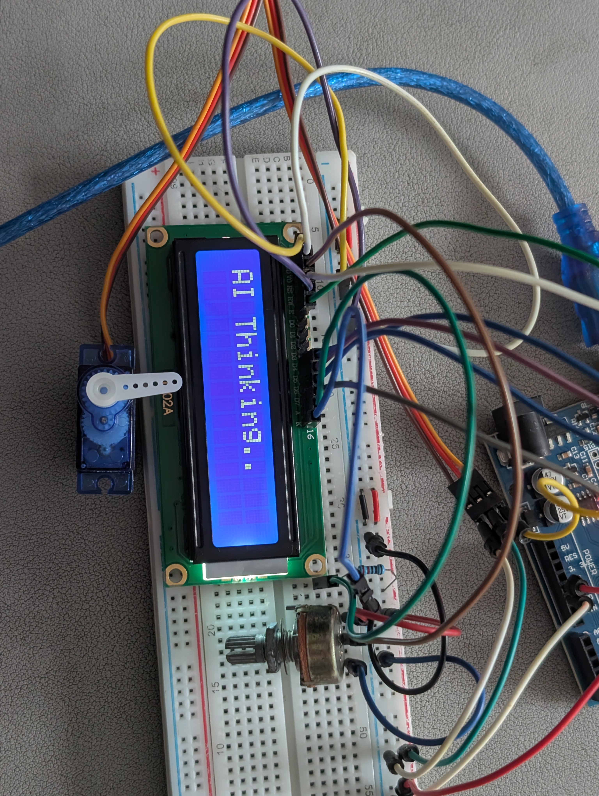

# Idea

I'm thinking of using an Arduino UNO hooked up to a servo motor and LCD display.
I want to incorporate a light weight AI model in this project.
Basically, I type in the CLI Terminal sentences like "Close the motor" or "Open the motor" and the motor will move accordingly. Also, terms like "Close the motor a bit/slightly" and "Open the motor a bit/slightly" will cause the motor to turn less. I will change the words if I want it to turn more, vice versa.

I can use Ollama phi3:mini model or other more light weight models as running service. Have it decide the final integer value needed to be sent to the arduino.

I'm using a Windows machine.

# Considerations & Improvements:

**Model Choice**: Llama 3 is powerful but might be overkill and slower. For faster responses and lower resource use, consider:

- mistral (7B)
- phi3 (even smaller, good for its size)
- gemma:2b

**Robustness of LLM Output**: LLMs can be verbose. You'll need good parsing logic in Python to extract the number. The "Respond ONLY with the integer" instruction helps, but isn't always perfectly followed. Regular expressions can be useful here.

**Error Handling**: What if the LLM doesn't understand or gives an invalid angle? Your Python script should handle this gracefully (e.g., ask the user to rephrase, or have fallback simple keyword matching).

**State Management**: The Python script maintaining current_motor_angle is key for relative movements ("a bit"). You could also have the Arduino report its actual angle back, but Python keeping track is simpler for this setup.

**Calibration**: Servo "0" and "180" positions might not be exactly what you want for "fully closed/open". You might want to define APP_MIN_ANGLE and APP_MAX_ANGLE (e.g., 10 and 170) in your Python script.

**Alternative to Pure LLM Angle Generation**:
Instead of the LLM outputting the exact angle, you could have it output a command category:

    {"action": "SET_ABSOLUTE", "value": 90}

    {"action": "OPEN_FULLY"}

    {"action": "CLOSE_FULLY"}

    {"action": "OPEN_SLIGHTLY"}

    {"action": "CLOSE_SLIGHTLY"}
    Then your Python script translates these structured commands into actual angles based on current_motor_angle and predefined steps. This can be more reliable than trying to get a precise number from the LLM every time, especially for relative movements. You can instruct the LLM to output JSON.

**Latency**: There will be some latency (CLI input -> Python -> Ollama -> Python -> Arduino -> Motor moves). For simple open/close, this is fine.

**Computer Vision and Machine Learning**: Use camera to detect a number of symbol that would then correspond to a particular action or command.

# Log
## Servo Control Without Display

## Display incorporated

## Speech added

## Reset state included

## Shutdown feature included

## Enhanced Servo Features Implemented: GOTO, ADJUST, SPIN, SWEEP, NOD, SHAKE
### GOTO

### ADJUST

### SPIN

### SWEEP

### NOD

### SHAKE

## Display commands added

## Mock Arduino for testing implemented

## Authentication for using MFRC522 RFID Module incorporated

## Fixed issues related to memory usage

### Debugging Log

#### Issue 1: `JSON Parse Error: NoMemory` and Unresponsive Servo

*   **Symptom:** After authenticating, the system would print `JSON Parse Error: NoMemory` for every command received from the LLM. The servo motor would not move.
*   **Root Cause:** The Arduino's limited SRAM (2KB) was being exhausted. The use of the `String` class for welcome messages and animation frames consumed a large portion of available memory, leaving insufficient space to create the JSON document for parsing new commands.
*   **Fix:**
    1.  **Memory Optimization:** Replaced memory-intensive `String` objects and arrays with C-style strings (`const char*`) in `servo_lcd_display.ino`.
    2.  **Flash Memory Usage:** Implemented the `F()` macro for all constant string literals (e.g., `Serial.println(F("Ready"));`) to store them in the Arduino's larger Flash memory instead of SRAM.
    3.  **Increased Buffer:** After freeing up SRAM, the `StaticJsonDocument` size was increased from `256` to `384` bytes to handle potentially larger LLM responses more robustly.

#### Issue 2: Compilation Errors After Memory Fix

*   **Symptom:** The code failed to compile after changing variables from `String` to `const char*`, citing errors like `request for member 'length'`, `conflicting declaration`, and `invalid application of 'sizeof'`.
*   **Root Cause:** The code refactor was incomplete.
    *   Functions were still trying to use `String` methods (like `.length()`) on C-style strings.
    *   Header file declarations (`extern String`) no longer matched the definitions (`const char*`) in the `.ino` file.
    *   `sizeof` could no longer determine array sizes from the header file alone.
*   **Fix:**
    1.  **Corrected Function Calls:** Replaced `.length()` with the standard C function `strlen()` in `display_functions.cpp` after including the `<string.h>` library.
    2.  **Synchronized Declarations:** Updated the `extern` variable declarations in `config.h` to use `const char*` to match their definitions.
    3.  **Centralized Definitions:** Moved the calculation of array sizes (`numWelcomeLines`, etc.) from `config.h` into `servo_lcd_display.ino`, where the arrays are actually defined and their size is known at compile time.
