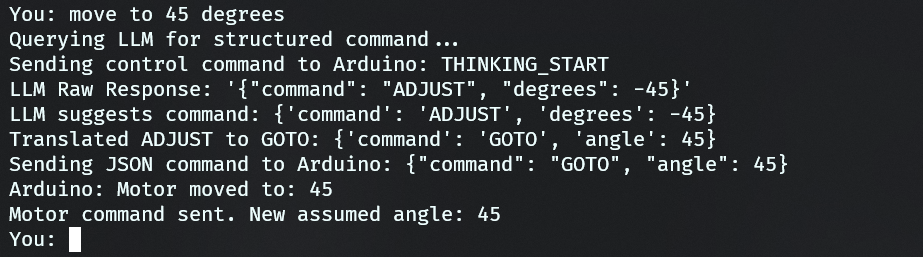

# Idea

I'm thinking of using an Arduino UNO hooked up to a servo motor and LCD display.
I want to incorporate a light weight AI model in this project.
Basically, I type in the CLI Terminal sentences like "Close the motor" or "Open the motor" and the motor will move accordingly. Also, terms like "Close the motor a bit/slightly" and "Open the motor a bit/slightly" will cause the motor to turn less. I will change the words if I want it to turn more, vice versa.

I can use Ollama phi3:mini model or other more light weight models as running service. Have it decide the final integer value needed to be sent to the arduino.

I'm using a Windows machine.

# Considerations & Improvements:

**Model Choice**: Llama 3 is powerful but might be overkill and slower. For faster responses and lower resource use, consider:

- mistral (7B)
- phi3 (even smaller, good for its size)
- gemma:2b

**Robustness of LLM Output**: LLMs can be verbose. You'll need good parsing logic in Python to extract the number. The "Respond ONLY with the integer" instruction helps, but isn't always perfectly followed. Regular expressions can be useful here.

**Error Handling**: What if the LLM doesn't understand or gives an invalid angle? Your Python script should handle this gracefully (e.g., ask the user to rephrase, or have fallback simple keyword matching).

**State Management**: The Python script maintaining current_motor_angle is key for relative movements ("a bit"). You could also have the Arduino report its actual angle back, but Python keeping track is simpler for this setup.

**Calibration**: Servo "0" and "180" positions might not be exactly what you want for "fully closed/open". You might want to define APP_MIN_ANGLE and APP_MAX_ANGLE (e.g., 10 and 170) in your Python script.

**Alternative to Pure LLM Angle Generation**:
Instead of the LLM outputting the exact angle, you could have it output a command category:

    {"action": "SET_ABSOLUTE", "value": 90}

    {"action": "OPEN_FULLY"}

    {"action": "CLOSE_FULLY"}

    {"action": "OPEN_SLIGHTLY"}

    {"action": "CLOSE_SLIGHTLY"}
    Then your Python script translates these structured commands into actual angles based on current_motor_angle and predefined steps. This can be more reliable than trying to get a precise number from the LLM every time, especially for relative movements. You can instruct the LLM to output JSON.

**Latency**: There will be some latency (CLI input -> Python -> Ollama -> Python -> Arduino -> Motor moves). For simple open/close, this is fine.

**Computer Vision and Machine Learning**: Use camera to detect a number of symbol that would then correspond to a particular action or command.

# Log
## Servo Control Without Display


## Display incorporated


## Speech added


## Reset state included


## Shutdown feature included


## Enhanced Servo Features Implemented: GOTO, ADJUST, SPIN, SWEEP, NOD, SHAKE
### GOTO


### ADJUST


### SPIN


### SWEEP


### NOD


### SHAKE


## Display commands added


## Mock Arduino for testing implemented


## Authentication for using MFRC522 RFID Module incorporated


## Fixed issues related to memory usage

### Debugging Log

#### Issue 1: `JSON Parse Error: NoMemory` and Unresponsive Servo

*   **Symptom:** After authenticating, the system would print `JSON Parse Error: NoMemory` for every command received from the LLM. The servo motor would not move.
*   **Root Cause:** The Arduino's limited SRAM (2KB) was being exhausted. The use of the `String` class for welcome messages and animation frames consumed a large portion of available memory, leaving insufficient space to create the JSON document for parsing new commands.
*   **Fix:**
    1.  **Memory Optimization:** Replaced memory-intensive `String` objects and arrays with C-style strings (`const char*`) in `servo_lcd_display.ino`.
    2.  **Flash Memory Usage:** Implemented the `F()` macro for all constant string literals (e.g., `Serial.println(F("Ready"));`) to store them in the Arduino's larger Flash memory instead of SRAM.
    3.  **Increased Buffer:** After freeing up SRAM, the `StaticJsonDocument` size was increased from `256` to `384` bytes to handle potentially larger LLM responses more robustly.

#### Issue 2: Compilation Errors After Memory Fix

*   **Symptom:** The code failed to compile after changing variables from `String` to `const char*`, citing errors like `request for member 'length'`, `conflicting declaration`, and `invalid application of 'sizeof'`.
*   **Root Cause:** The code refactor was incomplete.
    *   Functions were still trying to use `String` methods (like `.length()`) on C-style strings.
    *   Header file declarations (`extern String`) no longer matched the definitions (`const char*`) in the `.ino` file.
    *   `sizeof` could no longer determine array sizes from the header file alone.
*   **Fix:**
    1.  **Corrected Function Calls:** Replaced `.length()` with the standard C function `strlen()` in `display_functions.cpp` after including the `<string.h>` library.
    2.  **Synchronized Declarations:** Updated the `extern` variable declarations in `config.h` to use `const char*` to match their definitions.
    3.  **Centralized Definitions:** Moved the calculation of array sizes (`numWelcomeLines`, etc.) from `config.h` into `servo_lcd_display.ino`, where the arrays are actually defined and their size is known at compile time.

## Implemented RFID Bypass Mode for Testing/Development 


The primary goal of this update was to make development and testing easier by allowing the application to run without requiring a physical RFID scan or even a connected Arduino.

**Changes by File:**

1.  **`config.py`**
    *   **Added `BYPASS_RFID_AUTH` Toggle:** A new boolean flag was introduced to allow developers to completely skip the RFID authentication step. This speeds up testing of the core motor control and LLM features.
    *   **Leveraged `USE_MOCK_ARDUINO`:** The existing mock mode toggle is now more powerful.

2.  **`arduino.py`**
    *   **Enhanced Mock `ArduinoController`:** The `wait_for_response` method in mock mode was made "smarter."
    *   **Added `_simulate_rfid_auth_scenarios`:** When `USE_MOCK_ARDUINO` is `True` but `BYPASS_RFID_AUTH` is `False`, this new private method is called. It automatically simulates different outcomes (valid scan, invalid scan) to allow for testing the full authentication logic path without any hardware.

3.  **`main.py`**
    *   **Updated Authentication Logic:** The `authenticate()` method now checks for `cfg.BYPASS_RFID_AUTH` at the very beginning and returns a success state immediately if it's `True`.
    *   **Dynamic Startup Prompts:** The main execution block now inspects the configuration and displays a user-friendly message indicating whether RFID authentication is enabled, disabled, or if the system is in mock mode.

4.  **`README.md`**
    *   **Full Documentation Update:** The README was significantly updated to reflect the new features.
    *   Added a "Development & Testing Modes" section under **Features**.
    *   Clarified the new toggles in the **Configuration** section.
    *   Updated the **Running the Project** section to explain the new, dynamic startup prompts.

**Outcome:** The project can now be developed and tested in three distinct modes:
1.  **Full Hardware Mode:** Normal operation with Arduino and RFID.
2.  **Bypass Mode:** Hardware connected, but RFID scan is skipped.
3.  **Full Mock Mode:** No hardware needed; simulates both Arduino connection and various authentication events.

## Improving LLM Performance and Accuracy through Prompt Engineering

### Test 1

#### Prompt Used

```
You are an expert AI assistant that translates natural language commands into a structured JSON format for controlling a servo motor.
The motor's range is {min_angle} to {max_angle} degrees. The current motor angle is {current_angle} degrees.

Analyze the user's request and create a JSON object with a "command" and its required "parameters".

Available commands are:
1.  "GOTO": Move to a specific angle.
    - Parameters: "angle" (integer, {min_angle}-{max_angle}).
    - Example: "move to 90 degrees" -> {{"command": "GOTO", "angle": 90}}
    - Note: "open" means {max_angle}, "close" means {min_angle}, "middle" means 90.

2.  "ADJUST": Move by a relative amount of degrees.
    - Parameters: "degrees" (integer). Positive is clockwise (towards {max_angle}), negative is counter-clockwise (towards {min_angle}).
    - Example: "turn a little to the right" -> {{"command": "ADJUST", "degrees": 20}}
    - Example: "move 30 degrees left" -> {{"command": "ADJUST", "degrees": -30}}

3.  "SPIN": Perform full rotations back and forth.
    - Parameters: "times" (integer, number of full spins).
    - Note: This action ends at the starting angle.
    - Example: "spin 3 times" -> {{"command": "SPIN", "times": 3}}

4.  "SWEEP": Move back and forth continuously like a radar.
    - Parameters: "repetitions" (integer, number of back-and-forth sweeps).
    - Note: This action ends at the starting angle.
    - Example: "sweep back and forth 5 times" -> {{"command": "SWEEP", "repetitions": 5}}
    
5.  "NOD": Perform a "yes" motion.
    - Parameters: "times" (integer).
    - Example: "nod yes" -> {{"command": "NOD", "times": 2}}

6.  "SHAKE": Perform a "no" motion.
    - Parameters: "times" (integer).
    - Example: "shake your head" -> {{"command": "SHAKE", "times": 2}}

User Request: "{user_input}"
Current Angle: {current_angle}

Respond ONLY with the JSON object. Do not add any other text, explanation, or markdown formatting.
```

#### Output

```
$ python main.py
--------------------------------------------------
--- ARDUINO CONTROLLER IS IN MOCK MODE ---
--- No hardware connection will be attempted. ---
--------------------------------------------------
Checking system dependencies...
Ollama is running and accessible
MOCK: Simulating connection to Arduino on COM3...
MOCK: Connection successful.

-------------------------------------------
System connected. Arduino is in idle mode.
RFID Authentication: DISABLED (Testing Mode)
Type 'begin' to start motor control.
-------------------------------------------
> set
Invalid command. Please type 'begin' to continue.
> begin

--- Authentication Bypassed (Testing Mode) ---
RFID authentication is disabled in config.
Proceeding directly to motor control...
MOCK: Sending control command to Arduino: AUTH_SUCCESS_CMD
MOCK Arduino: OK

Motor Control CLI. Type 'speech' for voice, 'reset' for default, 'help' for list of commands or 'exit' to quit.
Current motor angle assumed to be: 90
You: set to 35
Querying LLM for structured command...
MOCK: Sending control command to Arduino: THINKING_START
MOCK Arduino: OK

--- LLM Performance ---
  - Round-trip Latency (Python): 11.68s
  - Prompt/Response Tokens:      626 / 16
  - Total Ollama Duration:       9613ms
    - Model Load Time:           6ms
    - Prompt Eval Time:          8647ms
    - Response Gen Time:         958ms
LLM Raw Response: '{"command": "GOTO", "angle": 35}'
LLM suggests command: {'command': 'GOTO', 'angle': 35}
MOCK: Sending JSON command to Arduino: {"command": "GOTO", "angle": 35}
MOCK Arduino: JSON_RECEIVED
Motor command sent. New assumed angle: 35
You: set to 36
Querying LLM for structured command...
MOCK: Sending control command to Arduino: THINKING_START
MOCK Arduino: OK

--- LLM Performance ---
  - Round-trip Latency (Python): 12.13s
  - Prompt/Response Tokens:      626 / 22
  - Total Ollama Duration:       10094ms
    - Model Load Time:           6ms
    - Prompt Eval Time:          8728ms
    - Response Gen Time:         1359ms
LLM Raw Response: '{
  "command": "GOTO",
  "angle": 36
}'
LLM suggests command: {'command': 'GOTO', 'angle': 36}
MOCK: Sending JSON command to Arduino: {"command": "GOTO", "angle": 36}
MOCK Arduino: JSON_RECEIVED
Motor command sent. New assumed angle: 36
You: set to 37
Querying LLM for structured command...
MOCK: Sending control command to Arduino: THINKING_START
MOCK Arduino: OK

--- LLM Performance ---
  - Round-trip Latency (Python): 11.89s
  - Prompt/Response Tokens:      626 / 15
  - Total Ollama Duration:       9849ms
    - Model Load Time:           4ms
    - Prompt Eval Time:          8940ms
    - Response Gen Time:         904ms
LLM Raw Response: '{"command": "GOTO", "angle": 4}'
LLM suggests command: {'command': 'GOTO', 'angle': 4}
MOCK: Sending JSON command to Arduino: {"command": "GOTO", "angle": 4}
MOCK Arduino: JSON_RECEIVED
Motor command sent. New assumed angle: 4
You:
```

### Test 2

I decided to try and use a small prompt to reduce the token usage.

#### Prompt Used

```
You are a JSON API for a servo motor.
Motor range: {min_angle}-{max_angle}. Current angle: {current_angle}.
Convert user request to a JSON object.

COMMANDS:
- "GOTO": {{"angle": <int>}} (Move to absolute angle. "middle" is 90, "open" is {max_angle}, "close" is {min_angle})
- "ADJUST": {{"degrees": <int>}} (Move by relative degrees. Positive is right, negative is left.)
- "SPIN": {{"times": <int>}} (Full back-and-forth rotations.)
- "SWEEP": {{"repetitions": <int>}} (Scan side-to-side.)
- "NOD": {{"times": <int>}} ("Yes" motion.)
- "SHAKE": {{"times": <int>}} ("No" motion.)

Request: "{user_input}"

Respond ONLY with the JSON object.
```

#### Output

```
$ python main.py
--------------------------------------------------
--- ARDUINO CONTROLLER IS IN MOCK MODE ---
--- No hardware connection will be attempted. ---
--------------------------------------------------
Checking system dependencies...
Ollama is running and accessible
MOCK: Simulating connection to Arduino on COM3...
MOCK: Connection successful.

-------------------------------------------
System connected. Arduino is in idle mode.
RFID Authentication: DISABLED (Testing Mode)
Type 'begin' to start motor control.
-------------------------------------------
> begin

--- Authentication Bypassed (Testing Mode) ---
RFID authentication is disabled in config.
Proceeding directly to motor control...
MOCK: Sending control command to Arduino: AUTH_SUCCESS_CMD
MOCK Arduino: OK

Motor Control CLI. Type 'speech' for voice, 'reset' for default, 'help' for list of commands or 'exit' to quit.
Current motor angle assumed to be: 90
You: set to 35
Querying LLM for structured command...
MOCK: Sending control command to Arduino: THINKING_START
MOCK Arduino: OK

--- LLM Performance ---
  - Round-trip Latency (Python): 10.59s
  - Prompt/Response Tokens:      250 / 32
  - Total Ollama Duration:       8535ms
    - Model Load Time:           1297ms
    - Prompt Eval Time:          5284ms
    - Response Gen Time:         1953ms
LLM Raw Response: '{
  "COMMANDS": {
    "ADJUST": {"degrees": -55}
  }
}'
LLM JSON is missing 'command' key.
AI could not determine a valid action. Please try rephrasing.
MOCK: Sending control command to Arduino: IDLE_STATE
MOCK Arduino: OK
You: set to 36
Querying LLM for structured command...
MOCK: Sending control command to Arduino: THINKING_START
MOCK Arduino: OK

--- LLM Performance ---
  - Round-trip Latency (Python): 4.28s
  - Prompt/Response Tokens:      250 / 32
  - Total Ollama Duration:       2226ms
    - Model Load Time:           6ms
    - Prompt Eval Time:          361ms
    - Response Gen Time:         1858ms
LLM Raw Response: '{
  "COMMANDS": {
    "ADJUST": {"degrees": -54}
  }
}'
LLM JSON is missing 'command' key.
AI could not determine a valid action. Please try rephrasing.
MOCK: Sending control command to Arduino: IDLE_STATE
MOCK Arduino: OK
You: set to 37
Querying LLM for structured command...
MOCK: Sending control command to Arduino: THINKING_START
MOCK Arduino: OK

--- LLM Performance ---
  - Round-trip Latency (Python): 4.24s
  - Prompt/Response Tokens:      250 / 32
  - Total Ollama Duration:       2200ms
    - Model Load Time:           7ms
    - Prompt Eval Time:          348ms
    - Response Gen Time:         1845ms
LLM Raw Response: '{
  "COMMANDS": {
    "ADJUST": {"degrees": -53}
  }
}'
LLM JSON is missing 'command' key.
AI could not determine a valid action. Please try rephrasing.
MOCK: Sending control command to Arduino: IDLE_STATE
MOCK Arduino: OK
You:
```

### Key Findings from Tests 1 and 2

1.  **Performance:** The lean prompt (`v2`) was significantly faster, reducing the average command latency from **~12 seconds to ~4 seconds**. This was primarily due to a **96% reduction in Prompt Evaluation Time**, as the model had far fewer tokens to process.

2.  **Accuracy:** The lean prompt (`v2`) completely failed to produce the correct JSON format, making it unusable. The verbose prompt (`v1`), while slow, was mostly accurate and always produced the correct structure.

**Conclusion:** A clear trade-off exists. The original prompt is too slow, while the optimized prompt is too unreliable. The model requires explicit examples ("few-shot prompting") to reliably generate the correct JSON structure. The next step is to develop a hybrid prompt that is both concise and includes clear examples.

#### Comparison Summary

| Metric | Test 1 (Verbose Prompt) | Test 2 (Lean Prompt) | Analysis / Winner |
| :--- | :--- | :--- | :--- |
| **Prompt Tokens** | 626 | **250** | **Test 2** (60% smaller) |
| **Avg. Latency** | ~11.9s | ~4.2s (after 1st run) | **Test 2** (65% faster) |
| **Avg. Prompt Eval Time**| ~8770ms | **~355ms** | **Test 2** (96% faster) |
| **Accuracy (Correct Logic)**| 66% (2 out of 3) | 0% | **Test 1** |
| **Reliability (Correct Format)**| 100% | 0% | **Test 1** |
| **Overall Usability** | Slow but Functional | Fast but Broken | **Neither**. A hybrid is needed. |

### Test 3

#### Prompt Used
```
You are a JSON API for a servo motor.
Motor range: {min_angle}-{max_angle}. Current angle: {current_angle}.
Convert the user request to a JSON object.

COMMANDS & EXAMPLES:
- "GOTO": Move to absolute angle. Ex: "go to 90" -> {{"command": "GOTO", "angle": 90}}
- "ADJUST": Move by relative degrees. Ex: "turn right a bit" -> {{"command": "ADJUST", "degrees": 20}}
- "SPIN": Full rotations. Ex: "spin twice" -> {{"command": "SPIN", "times": 2}}
- "SWEEP": Scan side-to-side. Ex: "sweep the area" -> {{"command": "SWEEP", "repetitions": 1}}
- "NOD": "Yes" motion. Ex: "nod yes" -> {{"command": "NOD", "times": 2}}
- "SHAKE": "No" motion. Ex: "shake no" -> {{"command": "SHAKE", "times": 2}}

Request: "{user_input}"

Respond ONLY with the JSON object.
```

#### Output
```
$ python main.py
--------------------------------------------------
--- ARDUINO CONTROLLER IS IN MOCK MODE ---
--- No hardware connection will be attempted. ---
--------------------------------------------------
Checking system dependencies...
Ollama is running and accessible
MOCK: Simulating connection to Arduino on COM3...
MOCK: Connection successful.

-------------------------------------------
System connected. Arduino is in idle mode.
RFID Authentication: DISABLED (Testing Mode)
Type 'begin' to start motor control.
-------------------------------------------
> begin

--- Authentication Bypassed (Testing Mode) ---
RFID authentication is disabled in config.
Proceeding directly to motor control...
MOCK: Sending control command to Arduino: AUTH_SUCCESS_CMD
MOCK Arduino: OK

Motor Control CLI. Type 'speech' for voice, 'reset' for default, 'help' for list of commands or 'exit' to quit.
Current motor angle assumed to be: 90
You: set to 35
Querying LLM for structured command...
MOCK: Sending control command to Arduino: THINKING_START
MOCK Arduino: OK

--- LLM Performance ---
  - Round-trip Latency (Python): 12.22s
  - Prompt/Response Tokens:      307 / 22
  - Total Ollama Duration:       10147ms
    - Model Load Time:           1301ms
    - Prompt Eval Time:          7427ms
    - Response Gen Time:         1419ms
LLM Raw Response: '{
  "command": "GOTO",
  "angle": 35
}'
LLM suggests command: {'command': 'GOTO', 'angle': 35}
MOCK: Sending JSON command to Arduino: {"command": "GOTO", "angle": 35}
MOCK Arduino: JSON_RECEIVED
Motor command sent. New assumed angle: 35
You: set to 36
Querying LLM for structured command...
MOCK: Sending control command to Arduino: THINKING_START
MOCK Arduino: OK

--- LLM Performance ---
  - Round-trip Latency (Python): 7.98s
  - Prompt/Response Tokens:      307 / 22
  - Total Ollama Duration:       5938ms
    - Model Load Time:           7ms
    - Prompt Eval Time:          4604ms
    - Response Gen Time:         1327ms
LLM Raw Response: '{
  "command": "GOTO",
  "angle": 36
}'
LLM suggests command: {'command': 'GOTO', 'angle': 36}
MOCK: Sending JSON command to Arduino: {"command": "GOTO", "angle": 36}
MOCK Arduino: JSON_RECEIVED
Motor command sent. New assumed angle: 36
You: set to 37
Querying LLM for structured command...
MOCK: Sending control command to Arduino: THINKING_START
MOCK Arduino: OK

--- LLM Performance ---
  - Round-trip Latency (Python): 7.98s
  - Prompt/Response Tokens:      307 / 22
  - Total Ollama Duration:       5942ms
    - Model Load Time:           6ms
    - Prompt Eval Time:          4606ms
    - Response Gen Time:         1330ms
LLM Raw Response: '{
  "command": "GOTO",
  "angle": 37
}'
LLM suggests command: {'command': 'GOTO', 'angle': 37}
MOCK: Sending JSON command to Arduino: {"command": "GOTO", "angle": 37}
MOCK Arduino: JSON_RECEIVED
Motor command sent. New assumed angle: 37
You:
```

### Key Findings from Tests 1, 2 and 3

Following the analysis of previous tests, a third "hybrid" prompt was designed to balance the performance benefits of a lean prompt with the accuracy benefits of a verbose one. This prompt uses a concise, direct structure while re-introducing one-line examples to provide essential structural guidance to the LLM.

#### Objective:
To determine if the hybrid prompt could achieve 100% accuracy and reliability while significantly reducing the latency observed in Test 1.

#### Results:
The test was a definitive success. The hybrid prompt achieved a perfect score on both accuracy and reliability for the test set, while substantially improving performance compared to the original verbose prompt.

*   **Accuracy and Reliability:** The model produced the correct JSON structure and accurate `GOTO` angle for all three test commands, including the one that failed in Test 1 (`set to 37`). This confirms the importance of including examples for reliable model output.

*   **Performance:** After an initial model load, the average command latency stabilized at **~8.0 seconds**, a **33% improvement** over Test 1's ~12-second latency. This was driven by a **48% reduction in Prompt Evaluation Time**, which dropped from ~8.8s to ~4.6s.

**Conclusion:** The hybrid prompt successfully resolves the performance-vs-accuracy trade-off. It is fast enough for practical use and, most importantly, has proven to be highly reliable. This prompt will be adopted as the new baseline for the project. The remaining latency is now understood to be a function of the hardware's processing capability rather than prompt inefficiency.

#### Final Comparison Summary

| Metric | Test 1 (Verbose) | Test 2 (Lean) | **Test 3 (Hybrid)** | Analysis |
| :--- | :--- | :--- | :--- | :--- |
| **Prompt Tokens** | 626 | 250 | **307** | **Winner**. Balanced size. |
| **Avg. Latency (Post-Load)**| ~11.9s | ~4.2s | **~8.0s** | **Winner**. Fastest *reliable* option. |
| **Avg. Prompt Eval Time**| ~8770ms | ~355ms | **~4605ms**| **Winner**. Best balance of speed and context. |
| **Accuracy (Correct Logic)**| 66% | 0% | **100%** | **Winner**. Flawless on this test set. |
| **Reliability (Correct Format)**| 100% | 0% | **100%** | **Winner**. Flawless structural output. |
| **Overall Usability** | Slow but Functional | Fast but Broken | **Fast Enough & Reliable** | **The new baseline.** |

### Further tests with hybrid prompt

#### Output
```
$ python main.py
Checking system dependencies...
Ollama is running and accessible
Connected to Arduino on COM3
Arduino (init): Arduino Ready. To find your card UID for config.py,
Arduino (init): run main.py and scan your card now.

-------------------------------------------
System connected. Arduino is in idle mode.
RFID Authentication: ENABLED
Type 'begin' to start authentication.
-------------------------------------------
> begin

--- Awaiting Authentication ---
Please scan an authorized RFID card on the reader.
Arduino response received: Card detected for auth! UID:0496C72B
Authentication successful! Welcome, Admin.

Motor Control CLI. Type 'speech' for voice, 'reset' for default, 'help' for list of commands or 'exit' to quit.
Current motor angle assumed to be: 90
You: set to 35
Querying LLM for structured command...

--- LLM Performance ---
  - Round-trip Latency (Python): 12.66s
  - Prompt/Response Tokens:      307 / 22
  - Total Ollama Duration:       10602ms
    - Model Load Time:           1294ms
    - Prompt Eval Time:          7900ms
    - Response Gen Time:         1407ms
LLM Raw Response: '{
  "command": "GOTO",
  "angle": 35
}'
LLM suggests command: {'command': 'GOTO', 'angle': 35}
Sending JSON command to Arduino: {"command": "GOTO", "angle": 35}
Arduino: Motor moved to: 35
Motor command sent. New assumed angle: 35
You: set to 36
Querying LLM for structured command...

--- LLM Performance ---
  - Round-trip Latency (Python): 8.29s
  - Prompt/Response Tokens:      307 / 22
  - Total Ollama Duration:       6233ms
    - Model Load Time:           5ms
    - Prompt Eval Time:          4864ms
    - Response Gen Time:         1363ms
LLM Raw Response: '{
  "command": "GOTO",
  "angle": 36
}'
LLM suggests command: {'command': 'GOTO', 'angle': 36}
Sending JSON command to Arduino: {"command": "GOTO", "angle": 36}
Arduino: Motor moved to: 36
Motor command sent. New assumed angle: 36
You: set to 37
Querying LLM for structured command...

--- LLM Performance ---
  - Round-trip Latency (Python): 8.48s
  - Prompt/Response Tokens:      307 / 22
  - Total Ollama Duration:       6408ms
    - Model Load Time:           6ms
    - Prompt Eval Time:          5043ms
    - Response Gen Time:         1358ms
LLM Raw Response: '{
  "command": "GOTO",
  "angle": 37
}'
LLM suggests command: {'command': 'GOTO', 'angle': 37}
Sending JSON command to Arduino: {"command": "GOTO", "angle": 37}
Arduino: Motor moved to: 37
Motor command sent. New assumed angle: 37
You: sweep like a soldier, do it three times
Querying LLM for structured command...

--- LLM Performance ---
  - Round-trip Latency (Python): 9.55s
  - Prompt/Response Tokens:      313 / 23
  - Total Ollama Duration:       7474ms
    - Model Load Time:           7ms
    - Prompt Eval Time:          5956ms
    - Response Gen Time:         1511ms
LLM Raw Response: '{
  "command": "SWEEP",
  "repetitions": 3
}'
LLM suggests command: {'command': 'SWEEP', 'repetitions': 3}
Sending JSON command to Arduino: {"command": "SWEEP", "repetitions": 3}
Arduino: Executing sweep sequence...
Sequence command 'SWEEP' sent. Angle remains: 37
You: spin around crazily twice
Querying LLM for structured command...

--- LLM Performance ---
  - Round-trip Latency (Python): 3.73s
  - Prompt/Response Tokens:      309 / 20
  - Total Ollama Duration:       1676ms
    - Model Load Time:           7ms
    - Prompt Eval Time:          462ms
    - Response Gen Time:         1204ms
LLM Raw Response: '{
  "command": "SPIN",
  "times": 2
}'
LLM suggests command: {'command': 'SPIN', 'times': 2}
Sending JSON command to Arduino: {"command": "SPIN", "times": 2}
Arduino: Sweep sequence complete. | Executing spin sequence...
Sequence command 'SPIN' sent. Angle remains: 37
You: for four times, nod
Querying LLM for structured command...

--- LLM Performance ---
  - Round-trip Latency (Python): 3.71s
  - Prompt/Response Tokens:      307 / 20
  - Total Ollama Duration:       1642ms
    - Model Load Time:           8ms
    - Prompt Eval Time:          424ms
    - Response Gen Time:         1210ms
LLM Raw Response: '{
  "command": "NOD",
  "times": 4
}'
LLM suggests command: {'command': 'NOD', 'times': 4}
Sending JSON command to Arduino: {"command": "NOD", "times": 4}
Arduino: Spin sequence complete. | Executing nod sequence...
Sequence command 'NOD' sent. Angle remains: 37
You: now shake around once
Querying LLM for structured command...

--- LLM Performance ---
  - Round-trip Latency (Python): 3.70s
  - Prompt/Response Tokens:      307 / 20
  - Total Ollama Duration:       1635ms
    - Model Load Time:           7ms
    - Prompt Eval Time:          434ms
    - Response Gen Time:         1195ms
LLM Raw Response: '{
  "command": "SHAKE",
  "times": 1
}'
LLM suggests command: {'command': 'SHAKE', 'times': 1}
Sending JSON command to Arduino: {"command": "SHAKE", "times": 1}
Arduino: Nod sequence complete. | Executing chaotic shake sequence...
Sequence command 'SHAKE' sent. Angle remains: 37
You: adjust by 40
Querying LLM for structured command...

--- LLM Performance ---
  - Round-trip Latency (Python): 3.96s
  - Prompt/Response Tokens:      308 / 24
  - Total Ollama Duration:       1902ms
    - Model Load Time:           8ms
    - Prompt Eval Time:          421ms
    - Response Gen Time:         1474ms
LLM Raw Response: '{
  "command": "ADJUST",
  "degrees": 40
}'
LLM suggests command: {'command': 'ADJUST', 'degrees': 40}
Translated ADJUST to GOTO: {'command': 'GOTO', 'angle': 77}
Sending JSON command to Arduino: {"command": "GOTO", "angle": 77}
Arduino: Shake sequence complete. | Motor moved to: 77
Motor command sent. New assumed angle: 77
You: adjust
Querying LLM for structured command...

--- LLM Performance ---
  - Round-trip Latency (Python): 8.11s
  - Prompt/Response Tokens:      304 / 22
  - Total Ollama Duration:       6059ms
    - Model Load Time:           7ms
    - Prompt Eval Time:          4682ms
    - Response Gen Time:         1370ms
LLM Raw Response: '{
  "command": "ADJUST",
  "degrees": null
}'
LLM suggests command: {'command': 'ADJUST', 'degrees': None}
Closing Arduino connection...
Connection closed.
Program finished.
Traceback (most recent call last):
  File "C:\Users\muadz\Muadz\School Work\NUS\Others\Year 1 Summer Break\ai-servo\main.py", line 236, in <module>
    app.run()
  File "C:\Users\muadz\Muadz\School Work\NUS\Others\Year 1 Summer Break\ai-servo\main.py", line 179, in run
    target_angle = self.current_angle + degrees
                   ~~~~~~~~~~~~~~~~~~~^~~~~~~~~
TypeError: unsupported operand type(s) for +: 'int' and 'NoneType'
```

### Findings from further tests

Conducted a comprehensive test of the system using the optimized "hybrid" prompt (v3) with a live Arduino connection. The goal was to validate the full range of commands and observe the LLM's performance characteristics under real-world conditions.

1.  **Critical Bug Discovered in `ADJUST` Command:** An ambiguous input like `adjust` (without a specified degree value) caused the LLM to correctly return `{"command": "ADJUST", "degrees": null}`. The Python script was not prepared to handle a `None` value for degrees, leading to a `TypeError` that crashed the program when it attempted to perform an arithmetic operation (`int + NoneType`). This highlights the need for robust input validation on all parameters received from the LLM.

2.  **Identified "Fast Path" vs. "Slow Path" Model Performance:** The testing revealed a clear and consistent performance pattern based on the user's input.
    *   **Fast Path (~3.7s Latency):** Occurred when user commands closely matched the examples provided in the prompt (e.g., `"spin ... twice"`). The model's "Prompt Eval Time" was extremely low (~450ms). This indicates the **"few-shot" examples are creating highly efficient pattern-matching shortcuts** for the model.
    *   **Slow Path (~8.5s Latency):** Occurred when commands required more interpretation or did not closely match an example (e.g., `"sweep like a soldier"`). The "Prompt Eval Time" increased by over 10x (~5000ms+), as the model had to rely on its slower, general reasoning abilities instead of simple pattern matching.

**Conclusion:** The hybrid prompt remains highly effective and accurate. The performance dichotomy between the "fast path" and "slow path" is a key characteristic of this implementation and demonstrates the powerful effect of few-shot prompting. The primary action item is to patch the critical `TypeError` to make the application robust against ambiguous user inputs.

#### Output after patch for the 'ADJUST' bug

```
$ python main.py
Checking system dependencies...
Ollama is running and accessible
Connected to Arduino on COM3
Arduino (init): Arduino Ready. To find your card UID for config.py,
Arduino (init): run main.py and scan your card now.

-------------------------------------------
System connected. Arduino is in idle mode.
RFID Authentication: ENABLED
Type 'begin' to start authentication.
-------------------------------------------
> begin

--- Awaiting Authentication ---
Please scan an authorized RFID card on the reader.
Arduino response received: Card detected for auth! UID:0496C72B
Authentication successful! Welcome, Admin.

Motor Control CLI. Type 'speech' for voice, 'reset' for default, 'help' for list of commands or 'exit' to quit.
Current motor angle assumed to be: 90
You: adjust
Querying LLM for structured command...

--- LLM Performance ---
  - Round-trip Latency (Python): 9.81s
  - Prompt/Response Tokens:      304 / 22
  - Total Ollama Duration:       7779ms
    - Model Load Time:           1048ms
    - Prompt Eval Time:          5461ms
    - Response Gen Time:         1270ms
LLM Raw Response: '{
  "command": "ADJUST",
  "degrees": null
}'
LLM suggests command: {'command': 'ADJUST', 'degrees': None}
AI understood 'ADJUST' but not the amount. Please be more specific (e.g., 'adjust by 20').
You: adjust by 20
Querying LLM for structured command...

--- LLM Performance ---
  - Round-trip Latency (Python): 3.89s
  - Prompt/Response Tokens:      308 / 24
  - Total Ollama Duration:       1818ms
    - Model Load Time:           7ms
    - Prompt Eval Time:          430ms
    - Response Gen Time:         1381ms
LLM Raw Response: '{
  "command": "ADJUST",
  "degrees": 20
}'
LLM suggests command: {'command': 'ADJUST', 'degrees': 20}
Translated ADJUST to GOTO: {'command': 'GOTO', 'angle': 110}
Sending JSON command to Arduino: {"command": "GOTO", "angle": 110}
Arduino: Motor moved to: 110
Motor command sent. New assumed angle: 110
You: adjust by 40
Querying LLM for structured command...

--- LLM Performance ---
  - Round-trip Latency (Python): 7.59s
  - Prompt/Response Tokens:      309 / 24
  - Total Ollama Duration:       5532ms
    - Model Load Time:           8ms
    - Prompt Eval Time:          4143ms
    - Response Gen Time:         1381ms
LLM Raw Response: '{
  "command": "ADJUST",
  "degrees": 40
}'
LLM suggests command: {'command': 'ADJUST', 'degrees': 40}
Translated ADJUST to GOTO: {'command': 'GOTO', 'angle': 150}
Sending JSON command to Arduino: {"command": "GOTO", "angle": 150}
Arduino: Motor moved to: 150
Motor command sent. New assumed angle: 150
You: adjust by 20 in the other direction
Querying LLM for structured command...

--- LLM Performance ---
  - Round-trip Latency (Python): 7.67s
  - Prompt/Response Tokens:      313 / 24
  - Total Ollama Duration:       5638ms
    - Model Load Time:           5ms
    - Prompt Eval Time:          4262ms
    - Response Gen Time:         1371ms
LLM Raw Response: '{
  "command": "ADJUST",
  "degrees": -20
}'
LLM suggests command: {'command': 'ADJUST', 'degrees': -20}
Translated ADJUST to GOTO: {'command': 'GOTO', 'angle': 130}
Sending JSON command to Arduino: {"command": "GOTO", "angle": 130}
Arduino: Motor moved to: 130
Motor command sent. New assumed angle: 130
You:
```

**Patch Validation: `ADJUST` Command Robustness**

Conducted validation testing on the bug fix for the `ADJUST` command.

#### Test & Results:
1.  **Ambiguous Input:** Provided the input `adjust`.
    *   **Outcome:** The patch was **successful**. The program no longer crashes. It correctly identifies the ambiguous command and prompts the user for a more specific value.
2.  **Specific Input:** Provided clear commands like `adjust by 20` and `adjust by 40`.
    *   **Outcome:** The system correctly parsed and executed the commands.
3.  **Natural Language Input:** Provided the input `adjust by 20 in the other direction`.
    *   **Outcome:** The model demonstrated strong natural language understanding by correctly interpreting the phrase as `{"command": "ADJUST", "degrees": -20}`.

**Conclusion:** The critical `TypeError` bug has been resolved. The system is now robust against ambiguous `ADJUST` commands and shows impressive capability in handling more complex natural language requests for this function.